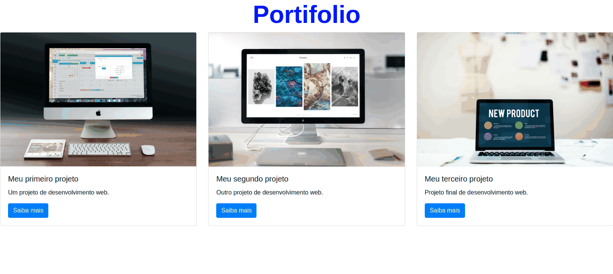

# Portifólio Web com Python e Django

O projeto consiste na costrução de uma aplicação web, utilizando o framework Django, que permite que o usuśrio mantenha armazenados e expostos seus projetos. Os projetos do usuário são inseridos e armazenados em um banco de dados [sqlite3](https://www.sqlite.org/index.html).
Além do framework foi utilizado conceitos basicos para o desenvolvimento da aplicação, os principais são:
 - [HTML5](https://developer.mozilla.org/pt-BR/docs/Web/Guide/HTML/HTML5)
 - [CSS3](https://developer.mozilla.org/pt-BR/docs/Web/CSS)
 - [JavaScript](https://www.javascript.com/)
 - [Bootstrap](https://getbootstrap.com/)
 - [sqlite3](https://www.sqlite.org/index.html)
 - [Django admin](https://docs.djangoproject.com/en/3.1/ref/contrib/admin/)

## Portifólio web

Iniciando o servidor do projeto: python3 manage.py runserver
Acessando o endereço:		  http://127.0.0.1:8000/projects/

  

 

